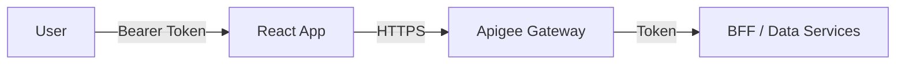

# Apigee Integration Strategy for Entra BFF Architecture

This document outlines the recommended security patterns for integrating **Apigee API Gateway** into the Entra ID BFF (Backend-for-Frontend) architecture.

## 🚫 The Security Constraint
**Browser-based applications (React) cannot safely store or transmit high-privilege credentials** such as:
*   **mTLS Client Certificates** (Private Keys)
*   **Apigee API Keys** (Client Secrets)

Exposing these in the frontend code allows any user to inspect the source and impersonate the application.

---

## ✅ Recommended Pattern: "BFF as the Secure Bridge"

In this architecture, the **BFF Backend** acts as the secure intermediary between the insecure browser environment and the highly secure Apigee Gateway.

### Architecture Flow
```mermaid
graph LR
    User[User (Browser)] -->|Session Cookie| React[React App (MFE)]
    React -->|HTTPS| BFF[BFF Backend (Spring Boot)]
    BFF -->|mTLS + API Key + Bearer Token| Apigee[Apigee Gateway]
    Apigee -->|Validated Request| Data[Data Backend Services]
```

### 1. React App -> BFF (User Session)
*   **Protocol:** HTTPS
*   **Authentication:** `JSESSIONID` (HttpOnly, Secure Cookie)
*   **Payload:** Standard JSON requests.
*   **Security:** 
    *   No Apigee secrets are present in the browser.
    *   The frontend is unaware of Apigee's existence.

### 2. BFF -> Apigee (The "Hard" Authentication)
The BFF is a trusted server-side component. It securely stores and uses the high-privilege credentials required by Apigee.

*   **Protocol:** mTLS (Mutual TLS)
*   **Authentication:** 
    1.  **Client Certificate:** The BFF presents a valid X.509 certificate to Apigee during the TLS handshake.
    2.  **API Key:** The BFF injects the Apigee API Key (e.g., `x-apikey: <secret>`) into the request header.
    3.  **User Identity:** The BFF forwards the user's **Entra ID Access Token** (Bearer Token) in the `Authorization` header so downstream services know *who* the user is.
*   **Secret Management:**
    *   Certificates and API Keys are stored in **Azure Key Vault** (or similar).
    *   The BFF retrieves them at startup via environment variables or a secrets manager.

### 3. Apigee -> Data Backend (Policy Enforcement)
*   **Validation:** Apigee verifies the mTLS certificate and API Key.
*   **Enforcement:** Apigee applies rate limiting, threat protection, and quota policies.
*   **Forwarding:** Apigee passes the request (including the User's Bearer Token) to the appropriate microservice.

---

## ⚠️ Alternative: "User Token" Pattern (Not Recommended for Certificates)

If Apigee is the *public entry point* (i.e., React talks directly to Apigee), you **cannot** use mTLS or API Keys safely.

### Architecture Flow


*   **Authentication:** The React App must acquire an **Entra ID Access Token** (via PKCE flow) and send it as a `Bearer` token to Apigee.
*   **Apigee's Role:** It validates the JWT signature against Entra ID's keys.
*   **Limitations:**
    *   **No mTLS:** Browsers cannot easily handle client certificates for API calls.
    *   **No API Keys:** You cannot hide the API Key in the browser.
    *   **Complexity:** The frontend must manage token refresh and storage logic (vulnerable to XSS).

### Conclusion
For internal enterprise applications requiring **mTLS** or **API Keys**, the **"BFF as the Bridge"** pattern is the only secure and viable choice.
